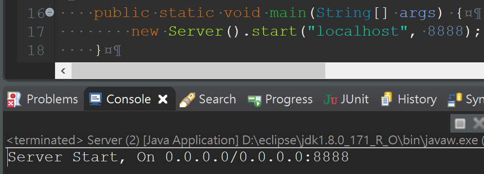
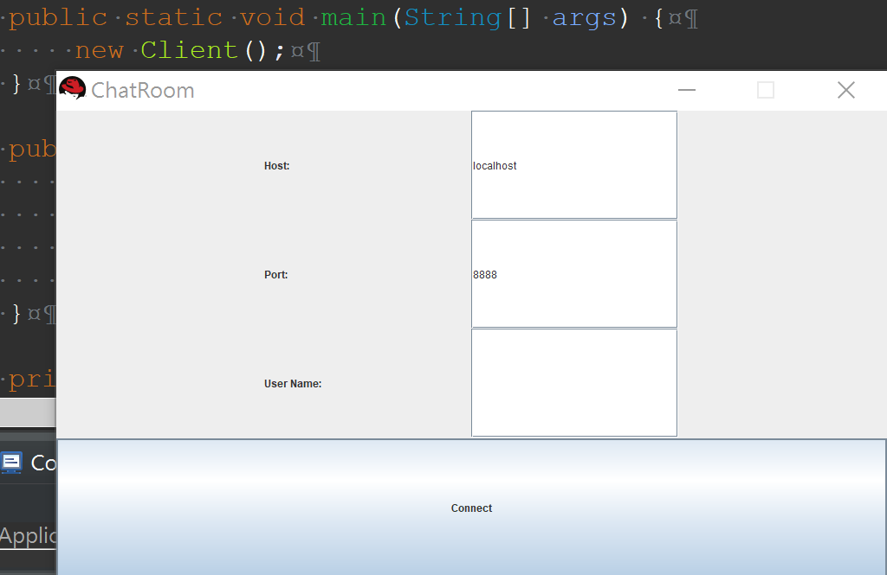

# ChatRoom
#### blocking and non-blocking chatroom implement

> 1. Implement blocking using ServerSocket and Socket.
> 2. Implement non-blocking using ServerSocketChannel, SocketChannel and Buffer.

----------------------------------------------------------------------------------

#### Demo
* Start the Server  
  

* Start the Client  
  
  
* Start Communication
